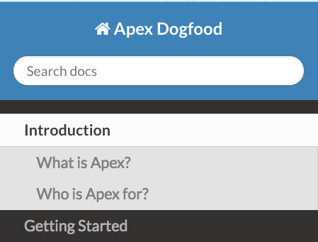
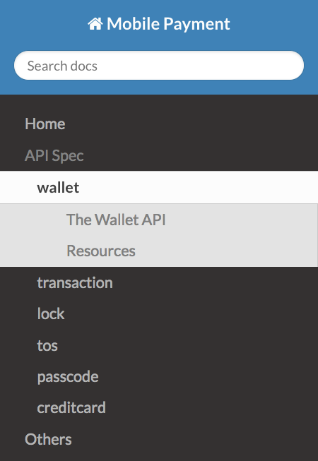
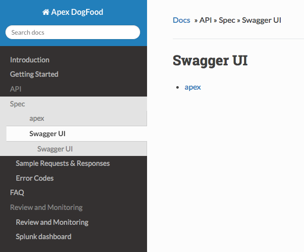
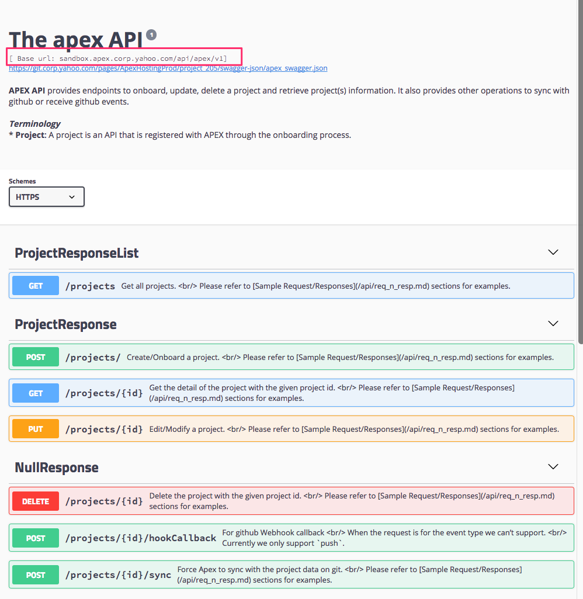
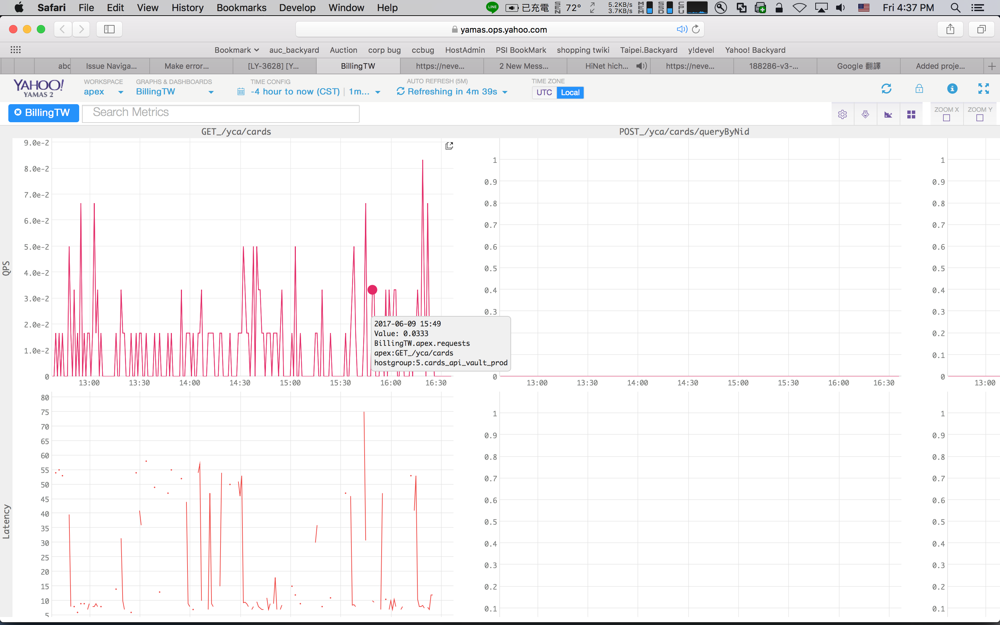

# Step 1 - Write your Documents
The most essential step is to write good-quality documents for your API and we believe excellent API documentation 
should include **API Specification** and **Auxiliary Documents**. 

## API Specification
API specification should include the description of API end points, request parameters, responses and error codes. 

* [Parsec](https://git.corp.yahoo.com/pages/ec-lightyear/parsec_docs/)-based APIs
    * Apex is capable of auto-generate API spec for APIs implemented with Parsec V2. Please comment your RDL files properly,
    as the comments will be used to describe the end points, fields... etc.
    * If your API is implemented with Parsec V1, please refer to [the V2 migration guide](https://git.corp.yahoo.com/pages/ec-lightyear/parsec_docs/v2/#migration-from-v1) and complete the migration first.
* Non-Parsec-based APIs. 
    * API owners will need to write the API spec manually in [Markdown][mdsyntax] format.
    

## Auxiliary Documents
Excellent API documents should provide more than API Specification. It should include overview, getting started guide, best practices, tutorials, etc. that help with using the API effectively. 


## Document Format and Source
Apex supports document source written in [Markdown][mdsyntax]. The document source should be placed in a directory somewhere in your project. 

By default this directory is `docs` under the project root (the top level of your project), and is [configurable](#step-2---create-apexconf). Please refer to [Layout](#layout-configuration) section for more details on how to configure your documentation.


## Linking Documents
Apex preserves the layout of  document source files and allows you to interlink your documentation by using regular Markdown hyperlinks. When linking between pages use the relative path to the Markdown document you wish to link to. 

Keep in mind that [API spec generated from RDL files](#api_spec) will be placed under the **top level** directory of the doucments. 

For example, with the following file structure: 
 
```
ProjectAwesome
|__apex.conf
|__docs/
| |__getting_started.md
| |__faq.md 
| |__api/
|    |__error.md
|    |__samples.md
|__src/main/
      |_rdl/
        |__awesome.rdl  
      |_java/     
```      

* To link to `faq.md` from `getting_started.md`:

    ```
    This is how you link to [FAQ](faq.md) from md files in the same directory.
    ```

* To link to `api/error.md` from `awesome.rdl`:
 
    ```
    This is how you link to [Error Code Table](api/error.md) from the RDL file. 
    ``` 

* To link to the generated API spec  from `api/samples.md`:

    ```
    This is how you link to the generated [API Spec](/awesome.md) from any other md file.
    ```
    
    or 
    
    ```
    This is how you link to the generated [API Spec](../awesome.md) with relatvie path. 
    ```


# Step 2 - Create `apex.conf`
Apex project configuration is in [typesafe](https://github.com/typesafehub/config) format and should be named `apex.conf`, located under the project root directory:

```
ProjectAwesome
|__apex.conf
|__docs/
| |__getting_started.md
| |__faq.md 
| |__api/
|    |__error.md
|    |__samples.md
|__src/main/
      |_rdl/
        |__awesome.rdl  
      |_java/         
``` 


A sample config file looks like this:

```
version = 1
doc_src_path = "docs"
rdl_src_path = "src/main/rdl"
layout =  [
           { title = "Getting Started", source = "index.md" },
           { title = "API Specification", source = %API_SPEC% },
           { title = "Tutorial", source = [
                { title = "5 minute guide", source = tutorial/simple.md },
                { title = "Advanced", source = tutorial/adv.md }
               ]
           },
           { title = "Other links", source = [
                { title = "Copyright", source = copyright.md },
                { title = "Review and Monitoring", source = %RELATED_LINKS% }
               ]
           }
       ]
test_host_url = "https://ccc-api1.cards.ec.tw1.yahoo.com:4443"
splunk_dashboard_url = "https://splunkv.nevec.yahoo.com:9999/en-US/app/search/awesome_api_dashboard"
review_url =  "https://yahoo.jiveon.com/thread/16705"       
property = "nevec"
is_on_mh = true
yms_main_tag = "nevec.apex"
```

| Key | Required | Type | Description | Default Value |
| ----- | ---- | --- | --- | --- |
| version | Yes | integer | The value must be **1**.  | N/A |
| layout | Yes | Array | Defines which pages to build and how they appear in the document navigation. See [Layout](#Layout) for details. | N/A|
| doc\_src_path | No | string | Specify the document source directory. | `docs` |
| rdl\_src_path | No | string | For parsec-based project to specify the RDL source file. | `src/main/rdl` | 
| test\_host_url | No | string | The url to the test host/sandbox. | - |
| review_url | No | string | The url to the jive post of API review. ex: `https://yahoo.jiveon.com/thread/16705`| - |
| splunk\_dashboard_url | No | string | The url to your API's splunk dashboard. | - |
| property | No | string | The property name, which should be aligned with opsdb. We currently support `nevec` and `billing`. Please contact us ([FAQ](faq.md)) if you don't see your property on the list.   | - |
| is_on_mh | No | boolean | Whether your project is host on Manhattan or not. | - |
| yms_main_tag | No | String | The hostgroup tag used for yamas, please contact your property PE for the value. | - |


## Layout Configuration
`layout` is the most important config element for apex onboarding configuration, as it defines which pages to build and how they appear in the documentation navigation.

The content of `layout` is expected to be an array of **title/source** pairs. Each **title/source** pair represents one Markdown file and shown as a single document page in the generated documents. 

A simple layout configuration looks like this has two top level pages: `Introduction` and `Getting Started`.

```
layout =  [
              { title = "Introduction", source = index.md },              
              { title = "Getting Started", source = getting_started.md }
          ]

```

And the generated navigation looks like this:




| Key | Required | Type | Description | Default Value |
| ----- | ---- | --- | --- | --- |
| title |  Yes | string | Specify the title shown on the navigation bar. | N/A |
| source | Yes | string | Specify the path to the Markdown file. The path is relative to the document source root, as specified in `doc_src_path`.  | N/A |


### Multilevel documentation
Apex supports multilevel documentation so that you can group related pages together. For example:

```
version = 1
layout = [
    { title = "Introduction", source = index.md },
    { title = "Getting Started", source = getting_started.md },
    { title = "API", source = [
        { title = "Spec", source = api/spec.md },
        { title = "Sample Requests & Responses", source = api/samples.md },
        { title = "Error Codes", source = api/error.md }
        ]
    },
    { title = "FAQ", source = faq.md }
]
```

With the configuration above  Apex will generate 4 top level sections: `Introduction`, `Getting Started`, `API` and `FAQ`. Under `API` there are 3 other pages: `Spec`, `Sample Requests & Responses` and `Error Codes`. 

### index.md

The `index.md` is mandatory for each project and should be the first file in `layout` configuration. Apex will generate one for you if none found.

### Reserved Keywords

#### %API_SPEC%

As mentioned in [API Specification](#api-specification), Apex is capable of auto-generating API spec for those implemented with Parsec V2. (If you would like to preview the generated documents, please refer to this section [Generate Code and Markdown (MD) files](https://git.corp.yahoo.com/pages/ec-lightyear/parsec_docs/quickstart/#3-generate-code)) This keyword can be seen as the "placeholder" to tell Apex where to place the auto-generated api specification.

Under the hood Apex generates one Markdown for each RDL file and placed under the top level directory of generated documents and the file name would be same as the RDL file name but with `.md` prefix. ex: The API spec generated from `apex.rdl` will be named `apex.md`. If your project has multiple RDL files, Apex will generate multiple md files for you.
	
For example, with this [example][exampleWithMultiRDLs] and simple configuration below:
	
```
layout = [
    { title = "API Spec", source = %API_SPEC% },
    { title = "Others", source = others.md }
]
```

Apex generates the navigation bar like this:




##### Swagger UI

Besides API Specification doc, Apex also generates Swagger UI for you, as shown below: 


And the API host is the `test_host_url` value specified in the `apex.conf` file.



However, since the swagger UI js file is not hosted on the same machine as the test host, you will need to enable and 
configure CORS filter in `DefaultWebListener.java` in order to make swagger ui works as expected:

```java
ServletContext sc = sce.getServletContext();

//Initialize the filter parameters 
FilterRegistration.Dynamic filter = sc.addFilter("CORS", CrossOriginFilter.class);
filter.addMappingForUrlPatterns(EnumSet.allOf(DispatcherType.class), true, "/*");

//this is where the swaggerUi.js is hosted at this point.
filter.setInitParameter(CrossOriginFilter.ALLOWED_ORIGINS_PARAM,
            "https://git.corp.yahoo.com,https://apex.corp.yahoo.com");

//determine the allowed methods and headers.
filter.setInitParameter(CrossOriginFilter.ALLOWED_METHODS_PARAM, "GET,PUT,POST,DELETE");
filter.setInitParameter(CrossOriginFilter.ACCESS_CONTROL_ALLOW_ORIGIN_HEADER, "*");
```


#### %RELATED_LINKS%

With this keyword, APEX will generate a page with links to `review_url`, `splunk_dashboard_url` and yamas dashboard if configured. Please refer to the [example][apexDogfoodRepo] for details.

##### Yamas Dashboard

Apex takes `property`, `is_on_mh` and `yms_main_tag` values from `apex.conf` and composite the yamas dashboard url for a project. 
By default the dashboard shows overall generic information such as total qps/latency, http status code distribution for the entire api as a whole.

However, the [dashboard for Parsec-based APIs][parsecYamas] can show broken-down statistics by each end point. For example, the QPS and latency for GET /yca/cards/{guid} as shown below:
[example URL](https://yamas.ops.yahoo.com:4443/#/ws/5bqkjz/bqa?_t.hostgroup=5.cards_api_vault_prod)


    


# Step 3 - Git Authorization
Apex requires owner privilege to your organization so it can fetch code, check permission and create webhooks on your repositories.

Please add Apex's headless account: `by-apex` to your organization and grant it **owner** permission.


Note that currently Apex only supports **Organizational** repositories as starting from Github Enterprise 2.0.0, collaborator of a Personal repositories can no longer add web hooks.  

# Step 4 - Submit repo URL on Apex Homepage
Go to [Apex Website][apexUI] to finish the onboarding.


* API Name: the name of the API.   
* Git Repo URL: the ssh url to the repository where the RDL source and documents source located. 
* Custodian: the email address of the custodian for this API. An ilist is preferred.
* Description: the description of what your API serves for.
* Is Open Api: your api will be published to outsider or not.


And Voilà! that's all you have to do to get on-board to Apex!

[mdsyntax]: https://github.com/adam-p/markdown-here/wiki/Markdown-Cheatsheet
[apexDogfoodRepo]: https://git.corp.yahoo.com/ApexExamples/ApexDogfood
[exampleWithMultiRDLs]: https://git.corp.yahoo.com/ApexExamples/MobilePayment
[apexUI]: http://yo/apex
[parsecYamas]: https://git.corp.yahoo.com/pages/ec-lightyear/parsec_docs/util/#yamas-configuration
